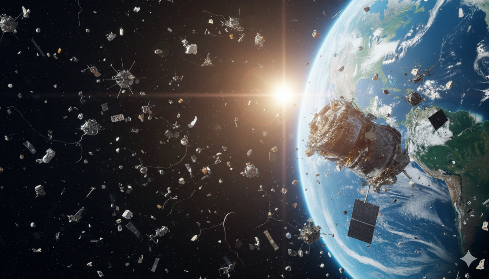

# Propuesta de Proyecto de Mentoría - DiploDatos 2026 

# 🛰🌎 **Predicciones en el Espacio: ¿Cuántos satélites y desechos podremos tener?**  

  

## 📌 Descripción y objetivos del proyecto  
En la última década, el número de satélites en órbita ha crecido exponencialmente debido a los avances tecnológicos y la reducción de costos (New Space) LO CUAL LLEVA A UNA VIDA UTIL MAS CORTA PERO MUY FACIL DE REEMPLAZAR 

tienen ciclo de vida de reemplazo muy cortos de unos 5 años 

En febrero de 2026, había aproximadamente [14.000 satélites activos en órbita](https://celestrak.org/NORAD/elements/table.php?GROUP=active&FORMAT=tle). Además, [1,23 millones de proyectos satelitales propuestos se encuentran en diversas etapas de desarrollo](https://outerspaceinstitute.ca/osisite/wp-content/uploads/Onemillionpapersatellites-AcceptedVersion.pdf).

Los satélites en órbita terrestre baja reflejan la luz solar durante aproximadamente dos horas después del atardecer y antes del amanecer. A pesar de los esfuerzos de ingeniería para reducir su brillo, los satélites del tamaño de un camión de muchas megaconstelaciones parecen puntos móviles en el cielo nocturno. Las proyecciones indican que los satélites futuros aumentarán significativamente esta contaminación lumínica.

 . Gracias a esto, grandes constelaciones de satelites se desplegaron en este último año aunque se prevee una [competencia por quien domina el espacio](https://www.adslzone.net/noticias/internet/amazon-leo-competencia-starlink-tiendas-fisicas/).

Sin embargo, hay un problema que vino de la mano y que hasta hace poco tiempo no era considerado importante: [los desechos espaciales](https://www.argentina.gob.ar/sinagir/riesgos-frecuentes/chatarra-espacial). Estos desechos van desde satélites fuera de servicio hasta naves espaciales abandonadas y escombros de misiones fallidas. 

Según la [NASA](https://svs.gsfc.nasa.gov/5258/) y [ESA](https://sdup.esoc.esa.int/discosweb/statistics/), actualmente hay más de 30.000 objetos rastreados en órbita, y tambien se lleva un [registro](https://spacesecurity.wse.jhu.edu/space-collisions/) de las colisiones a lo largo del tiempo. Se pronostica que, con el paso del tiempo, las dificultades se irán multiplicando. Es por esto que se necesita lograr dar una solución efectiva al asunto.

**El objetivo de este proyecto es desarrollar un modelo predictivo de la vida útil de satelines en órbita terrestre. El modelado se llevará a cabo mediante técnicas de Aprendizaje Supervisado y/o No Supervisado.**

La propuesta busca analizar y correlacionar un conjunto de datos históricos que incluyen información sobre lanzamientos, satélites fuera de servicio, tamaño, órbita, período, misión, vida útil, etc., para entender su impacto en la cantidad de objetos en órbita, ya sean satélites funcionales o desechos espaciales.  

El proyecto busca responder las siguientes preguntas:  

- **¿Cómo ha evolucionado la cantidad de satélites y desechos espaciales en los últimos años?**  
- **¿Cuál es la vida útil real de un satélite?**  
- **¿Existen patrones en la distribución de basura espacial en diferentes órbitas?**  
- **¿Qué países generan más desechos en el espacio?**  
- **¿Podemos predecir la cantidad de desechos espaciales en los próximos años?**  

## 🗃 Datos  

La información fue extraída de [Space-Track.org](https://www.space-track.org/), operado por U.S. Space Force del Departamento de Defensa de los Estados Unidos.

El dataset está dividido en diferentes archivos:  

- `satellites.json`: contiene información de los satélites lanzados hasta febrero de 2026.  
- `debris.json`: incluye datos sobre desechos espaciales en órbita hasta febrero de 2026.  
- `rockets.json`: incluye datos sobre los lanzadores en órbita hasta febrero de 2026. 
- `unknown.json`: incluye datos sobre objetos no identificados en órbita hasta febrero de 2026. 

## 💻 Desarrollo 

El desarrollo de este proyecto se divide de la siguiente manera: 

- [Introducción a los Satélites](docs/intro_satelites.md)
- [Descripción de los Datos](docs/dataset.md)
- [Análisis y Visualización](docs/analisis_y_visualizacion.md)
- [Análisis Exploratorio y Curación de Datos](docs/analisis_exploratorio.md)
- [Aprendizaje Supervisado y/o No Supervisado](docs/aprendizaje.md)
- [Resultados y Conclusiones](docs/resultados.md)

## 📚 Referencias
- [Space-Track API](https://www.space-track.org/documentation#/api)
- [ISS Tracker](https://isstracker.pl/en)
- [How many satellites can we safely fit in Earth orbit?](https://www.n2yo.com/satellite-article/How-many-satellites-can-we-safely-fit-in-Earth-orbit/86)
- Kessler, D. J. (1991). Collisional cascading: The limits of population growth in low Earth orbit. Advances in Space Research, 11(12), 63–66.
- https://phys.org/news/2026-02-satellites-earth-orbit-track-catastrophe.html
- https://www.space.com/space-exploration/satellites/satellite-megaconstellations-continue-to-grow-could-their-debris-fall-on-us

</b>
 EnzoRg | <a href="/README.md">Contenidos</a>
