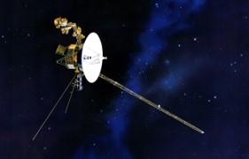
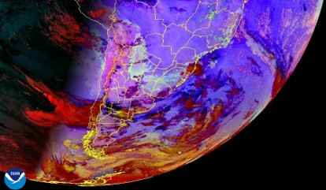
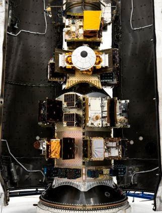
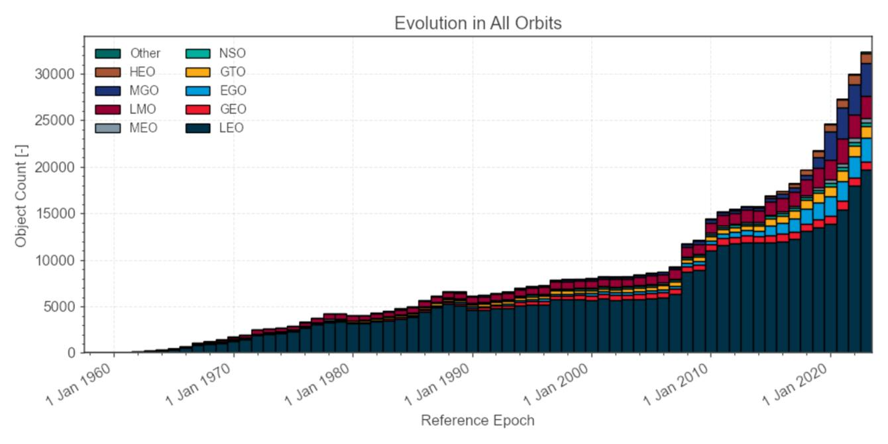
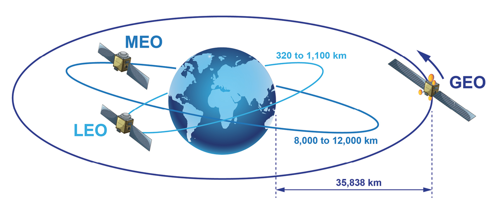
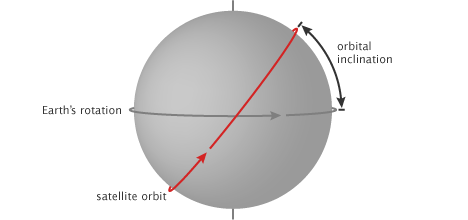

<!-- _class: lead -->

# Introduccion al proyecto de mentoria

Enzo Nicolás Manolucos  

## Objetivos

Realizar una introducción breve al proyecto y a los conceptos necesarios para abordarlo.

- Entender la problemática de los satélites y desechos espaciales.
- Introducir qué es un satélite y por qué es importante.
- Presentar el contexto de New Space.
- Conectar el problema con el dataset del proyecto.
- Mostrar las primeras preguntas de análisis y modelado.

## Sobre mí

- Nací en Río Gallegos y vivo en Córdoba hace más de diez años.
- Soy Ingeniero Electrónico.
- Realice la Diplomatura en Ciencia de Datos en 2024.
- Estoy realizando la Maestría en Minería de Datos.

Experiencia:

- Desarrollo de sistemas de comunicación satelital.
- Procesamiento de imágenes SAR.
- Ciencia de datos aplicada a datos espacio-temporales.
- Docencia universitaria.

## ¿Qué es un satélite?

Un satélite es un objeto que se mueve alrededor de otro más grande.

Puede ser:

- **Natural**, como la Luna alrededor de la Tierra.
- **Artificial**, como una máquina construida para orbitar la Tierra u otros cuerpos celestes.

En este proyecto, cuando hablamos de satélites nos referimos a satélites artificiales.

## ¿Para qué se usan?

Existen miles de satélites artificiales con objetivos muy distintos:

- Observar la Tierra, el clima, los océanos, incendios y cultivos.
- Brindar telecomunicaciones, televisión e internet.
- Dar posicionamiento y navegación global.
- Investigar el espacio profundo y otros planetas.
- Desarrollar y validar nuevas tecnologías.
- Apoyar aplicaciones militares, de seguridad y gestión de emergencias.

## Antes de los satélites

Las capacidades globales eran mucho mas limitadas:

- Las señales de TV y comunicaciones tenían alcance restringido.
- Las comunicaciones de larga distancia eran costosas y complejas.
- No existía observación global y continua de la Tierra.
- La información sobre clima, océanos, incendios y cultivos era más fragmentada.
- El acceso a internet en zonas remotas dependía casi totalmente de infraestructura terrestre.

## Con los satélites

Los satélites permiten:

- Cobertura global de comunicaciones.
- Transmisión de información entre puntos distantes del planeta.
- Navegación y posicionamiento con sistemas como GPS.
- Monitoreo continuo de la Tierra.
- Mejor predicción y gestión de fenómenos naturales.
- Nuevas fuentes de datos para ciencia, industria y políticas públicas.

## El modelo New Space

New Space es una forma moderna de pensar la industria espacial.

Frente al modelo tradicional, dominado por agencias gubernamentales y proyectos de alto costo, New Space impulsa un ecosistema más ágil, comercial y orientado a datos.

## New Space en la practica

El modelo New Space se apoya en:

- Reducción de costos de acceso al espacio.
- Mayor participación de empresas privadas.
- Desarrollo rápido e iterativo.
- Satélites pequeños y constelaciones.
- Alta frecuencia de revisita.
- Datos más accesibles y servicios globales.

## Caso reciente: Transporter-16

El 30 de marzo de 2026, [SpaceX](https://www.spacex.com/launches/transporter16) lanzó la misión Transporter-16, una misión de transporte compartido con **119 payloads** hacia órbita baja terrestre.

Este tipo de misiones muestra una tendencia clave:

- muchos objetos en un unico lanzamiento;
- mayor participacion comercial;
- más satélites pequeños;
- crecimiento acelerado de la población orbital.

## La otra cara del crecimiento

Más satélites también implica más complejidad:

- mayor ocupación de órbitas útiles;
- más objetos inactivos;
- fragmentos y restos de misiones;
- riesgo de colisiones;
- necesidad de seguimiento, predicción y mitigación.

Este es el punto de entrada del proyecto: entender cómo evoluciona el entorno orbital y qué podemos anticipar con datos.

## ¿Qué son los desechos espaciales?

Los desechos espaciales incluyen:

- Satélites fuera de servicio.
- Restos de lanzamientos.
- Fragmentos de colisiones o explosiones.
- Objetos abandonados en órbita.

Aunque muchos son pequeños, viajan a velocidades orbitales muy altas y pueden representar riesgo para satélites activos y misiones tripuladas.

## Clasificación de satélites

Un satélite está compuesto principalmente por:

- **Plataforma**: estructura, energía, control térmico, comunicación y control de actitud.
- **Carga útil**: instrumento o sistema que cumple la misión principal.

Según su carga útil, se pueden clasificar por propósito.

## Clasificación por propósito

- **Comunicaciones**: Starlink, ARSAT.
- **Navegación y posicionamiento**: GPS / NAVSTAR, Galileo.
- **Observación de la Tierra**: Landsat, Sentinel, SAOCOM, NOAA-20.
- **Ciencia espacial**: James Webb, Voyager.
- **Desarrollo tecnológico**: PROBA, demostradores tecnológicos.
- **Otros usos específicos**: vigilancia, meteorología, educación, servicios experimentales.

## Tipos de órbitas

También se clasifican según la órbita que describen:

- **LEO**: órbita terrestre baja, entre 160 y 2.000 km.
- **MEO**: órbita terrestre media, entre 2.000 y 35.786 km.
- **GEO**: órbita geoestacionaria, a 35.786 km sobre el ecuador.
- **HEO**: órbitas elípticas, útiles para cobertura en altas latitudes.

---

## Inclinación orbital

La inclinación es el ángulo entre el plano de la órbita y el ecuador terrestre.

- Una inclinación de **0 grados** indica una órbita ecuatorial.
- Una inclinación de **90 grados** indica una órbita polar.

Esta variable ayuda a entender qué regiones de la Tierra puede observar o cubrir un satélite.

# Problema del proyecto

El crecimiento de satélites y desechos plantea preguntas de ciencia de datos:

- ¿Cómo evolucionó la cantidad de objetos en órbita?
- ¿Qué objetos siguen activos y cuáles ya no?
- ¿Cómo se distribuyen por país, propósito y órbita?
- ¿Qué patrones aparecen antes de que un satélite quede fuera de servicio?
- ¿Podemos estimar vida útil real o anticipar escenarios de riesgo?

---

# Objetivo del proyecto

Predecir la vida útil real de un satélite antes de que quede fuera de servicio.

La idea es mejorar la comprensión del entorno espacial usando:

- datos históricos de lanzamientos;
- información orbital;
- estado actual de los objetos;
- tipo de misión;
- tecnicas de aprendizaje supervisado y no supervisado.

---

# Dataset principal

Archivo: `data/raw/satellites_202602.csv`

Contiene datos actualizados hasta febrero de 2026 y combina:

- **Space-Track.org**: catálogo histórico de objetos orbitales.
- **CelesTrack**: satélites activos en órbita.
- **UCS Satellite Database**: propósito de misión, actualizado y curado.

---

# Variables disponibles

Algunas columnas relevantes:

- `OBJECT_TYPE`: tipo de objeto.
- `SATNAME`: nombre del satélite u objeto.
- `COUNTRY`: país responsable.
- `LAUNCH`: fecha de lanzamiento.
- `DECAY`: fecha de reentrada, si corresponde.
- `PERIOD`, `INCLINATION`, `APOGEE`, `PERIGEE`: variables orbitales.
- `ACTIVE`: estado activo.
- `PURPOSE`: propósito de la misión.

---

# Primeras cifras

Total de registros: **59.997**

Por tipo de objeto:

- **35.740** debris.
- **24.257** payloads.

Por estado:

- **14.009** activos.
- **45.988** no activos.

Rango temporal de lanzamientos: **1957 a 2026**.

---

# Objetos por tipo

---

# Estado de actividad

---

# Actividad reciente

La actividad reciente refuerza la necesidad de estudiar tendencias y escenarios futuros.

---

# Payloads por propósito

Entre los payloads, predominan comunicaciones y desarrollo tecnológico.

---

# Distribución orbital aproximada

La órbita baja terrestre concentra la mayor parte de los registros.

---

# Países y organizaciones

Esta vista permite empezar a discutir responsabilidades históricas, volumen de actividad y generación de objetos en órbita.

---

# Etapas de trabajo

1. Comprender el dominio: satélites, órbitas, inclinación, velocidad y propósito.
2. Explorar los datos: tipos de objeto, países, fechas, estados y valores faltantes.
3. Curar el dataset: tipos de datos, duplicados, imputación y variables derivadas.
4. Modelar: clasificación, regresión, clustering o una combinación.
5. Evaluar: comparar modelos y documentar limitaciones.

---

# Posibles enfoques de aprendizaje

- **Clasificación**: estimar estado, riesgo o categorías de objetos.
- **Regresión**: estimar vida útil real.
- **Clustering**: agrupar objetos por patrones orbitales o de misión.
- **Reducción de dimensionalidad**: visualizar estructuras en datos complejos.

Modelos posibles: modelos base, Random Forest, Gradient Boosting, SVM y redes neuronales.

---

# Preguntas para trabajar

- ¿Cómo evolucionó la cantidad de satélites y debris?
- ¿Qué variables influyen más en la vida útil real?
- ¿Hay diferencias por tipo de órbita?
- ¿Qué países u organizaciones concentran más objetos?
- ¿Cómo impacta New Space en la población orbital?
- ¿Podemos proyectar la cantidad de desechos en los próximos años?

---

# Cierre

El espacio cercano a la Tierra ya no puede pensarse como un recurso ilimitado.

Este proyecto propone usar datos abiertos, análisis exploratorio y aprendizaje automático para comprender la dinámica de satélites y desechos espaciales.

El objetivo final es transformar un catálogo histórico de objetos orbitales en conocimiento útil para anticipar tendencias, riesgos y escenarios futuros.

---

# Referencias

- README del proyecto.
- `docs/intro_satelites.md`
- `docs/dataset.md`
- `docs/analisis_y_visualizacion.md`
- `docs/analisis_exploratorio.md`
- `docs/aprendizaje.md`
- `data/raw/satellites_202602.csv`
- Via Satellite: SpaceX launches 119 payloads on Transporter-16, 30 de marzo de 2026.
