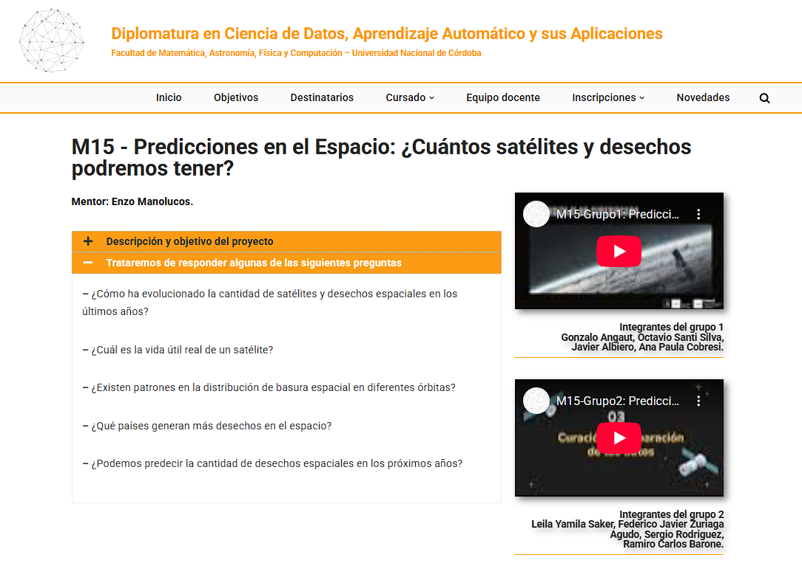

# Resultados y Conclusiones 

En el marco de la [Diplomatura en Ciencia de Datos, Aprendizaje Automático y sus Aplicaciones](https://diplodatos.famaf.unc.edu.ar/), los alumnos realizaron una serie de [videos](https://diplodatos.famaf.unc.edu.ar/metodologia-y-modalidad-de-cursado/mentorias/mentorias-trabajos-finales-2025/m15-2025/) donde muestran los pasos que siguieron para crear modelos a partir de un dataset.

  

##

Atrás | <b><a href="aprendizaje.md">Aprendizaje Supervisado y/o No Supervisado</a>

</b>
 EnzoRg | <a href="../README.md">Contenidos</a>
